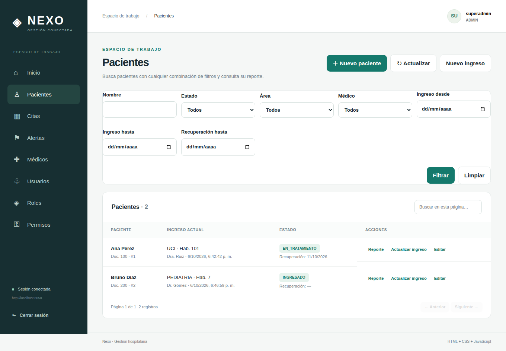

# NEXO · Gestión hospitalaria

Plataforma web con **backend Java 21 / Spring Boot 4.1.1 / PostgreSQL** y
**frontend HTML, CSS y JavaScript**. Implementa los módulos de **reportes,
alertas y filtros** sobre pacientes, médicos, ingresos y citas, con
autenticación JWT y permisos por rol (administrador, médico, enfermero y recepción).

Basada en la plantilla de seguridad de Cristian Díaz (ver autoría al final).

## Estructura

```text
├── docker-compose.yml                   PostgreSQL para desarrollo
├── spring-security-user-role-management/
│   ├── README.md                        Guía del backend: configuración y endpoints
│   ├── docs/MODULOS_HOSPITAL.md         Diseño de los módulos y decisiones tomadas
│   └── src/                             Código y tests
└── Frontend/
    ├── README.md                        Guía de la interfaz
    └── index.html, app.js, styles.css
```

## Inicio rápido

Requisitos: JDK 21, Docker y un navegador.

```bash
# 1. Base de datos (crea el servidor y la base sistema_gestion_usuarios)
docker compose up -d

# 2. Backend en http://localhost:8050
cd spring-security-user-role-management
./gradlew bootRun                # en Windows: .\gradlew.bat bootRun

# 3. Frontend en http://127.0.0.1:5500 (en otra terminal)
cd Frontend
python3 -m http.server 5500 --bind 127.0.0.1
```

Entra con `superadmin` / `SuperAdmin123!` (cuenta de desarrollo). Desde
**Usuarios** crea cuentas con los roles MEDICO, ENFERMERO o RECEPCION. Desde
**Médicos**, vincula cada cuenta MEDICO a su médico.

| Recurso | Dirección |
| --- | --- |
| Backend | http://localhost:8050 |
| Swagger UI | http://localhost:8050/swagger-ui.html |
| Frontend | http://127.0.0.1:5500 |

## Qué puede hacer cada rol

| Rol | Reportes | Alertas | Filtros de pacientes | Citas |
| --- | --- | --- | --- | --- |
| Administrador | Sí | Sí | Sí | Sí |
| Médico | Sus pacientes | Sus pacientes | Sus pacientes | Sus pacientes (consulta) |
| Enfermero | No | Sí | Sí | No |
| Recepción | No | No | No (registra pacientes y los busca por documento) | Sí |

Además, el administrador gestiona cuentas, roles, permisos y médicos. Los
médicos registran ingresos a su nombre y actualizan su estado.

## Flujo para probar

1. Como `superadmin`, crea una cuenta MEDICO y un médico vinculado a ella.
2. Registra un paciente y un ingreso con fecha estimada de recuperación.
3. Entra como el médico, cambia el estado del ingreso y abre el **Reporte**.
4. Agenda una cita (como administrador o recepción).
5. En **Alertas** aparecen el cambio de estado y la cita; márcalas como atendidas.
6. En **Pacientes**, prueba los filtros, por ejemplo *Recuperación hasta* = hoy + 7 días.

## Verificación

```bash
cd spring-security-user-role-management && ./gradlew test
```

Los tests cubren la seguridad (incluida la escalada de privilegios) y el flujo
completo de los módulos del hospital por rol. Además, se probó contra PostgreSQL
real y en el navegador con los cuatro roles.



---
## 👨‍💻 Autor

**Ing. Cristian Díaz**

<p align="center">
  
</p>
